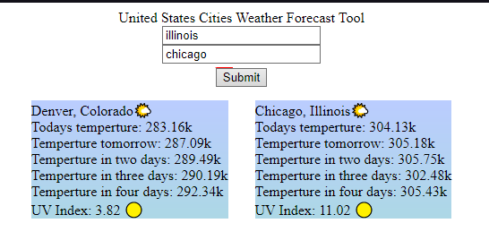

# WeatherSearcher

Goals/Motivation:

Apply weather api to implement a city searchbar.

Searching a city returns a 5 day weather report, current weather, icon representing weather, humidity, wind speed, and UV index.

Create functionality for swapping between days.

I wanted to not use Bootstrap at all for this project.

https://simplysimplify.github.io/WeatherSearcher/
